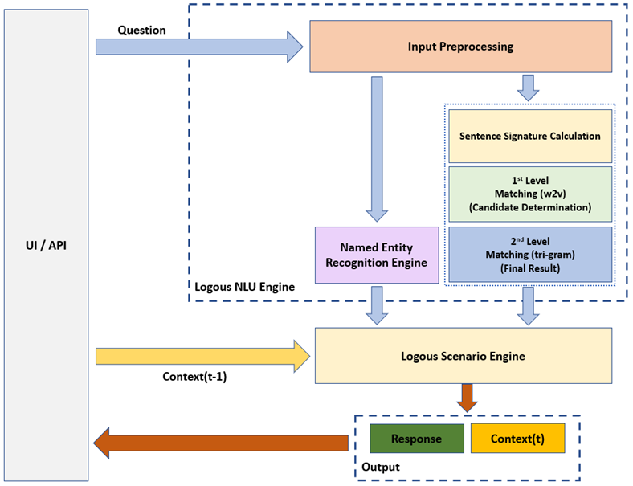

# logous-chatbot
logous-chatbot is a retrieval and scenario based chatbot library, that takes the advantages of word embedding and ngram based similarity ensembles.

Please refer to "SampleChatbotTrain.ipynb" and "SampleChatbotTest.ipynb" for chatbot training and test examples.

## Architecture

